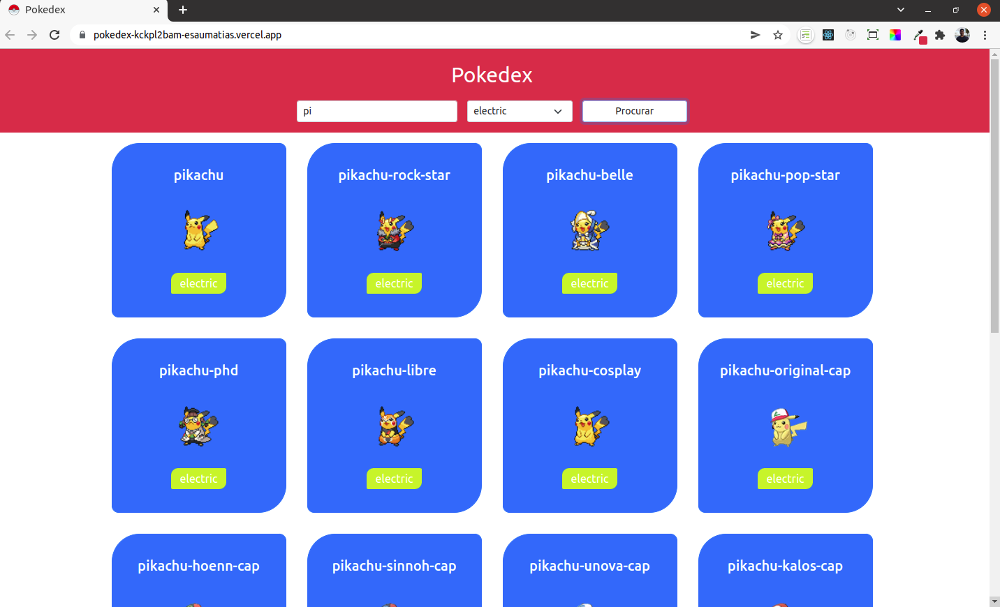

## Projeto Pokedex

_[Acesse aqui](https://pokedex-woad-beta.vercel.app/)_

### Contexto

Neste projeto é feita uma requisição à API pokeapi e é renderizada uma tabela com o nome dos 25 primeiros Pokemons. Além disso, é possível filtrar um Pokemon pelo seu nome e tipo e ao clicar nele é direcionado para pagina de detalhes do pokemon. O layout da aplicação foi pensado tanto pra web quanto pra mobile.

### Tecnologias usadas

>React, Context-API, Hooks, JavaScript, HTML, CSS, Bootstrap

### Instalação do projeto

1. Clonar o link do repositório git clone git@github.com:esaumatias/Pokedex.git
2. Instalar as dependência necessárias para o projeto: ```npm install```
3. Iniciar o projeto: ```npm start```

;
